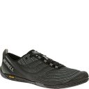

# Machine Learning CAS Module 3

### Description
Using Zalando dataset for tensorflow classification with a Neuronal network as a practice to recognize clothes, before starting to do the same but with berries.

### Tested images

For the sake of the practice I used 3 of my desired images to test if the model will be able to somehow recognize uncentred but ```28x28``` images.

#### My first image would be a flat sneaker


#### My second image would be a tshirt


#### My last image would be an another flat sneaker
  

If something else is needed there is a contact direction.

#### Date, author and contact

```<!-- console marius >>: date +'%A %d.%B.%Y'-->
Friday 09.July.2020
```  

[Marius Botos](https://twitter.com/MariusBotos)
 
